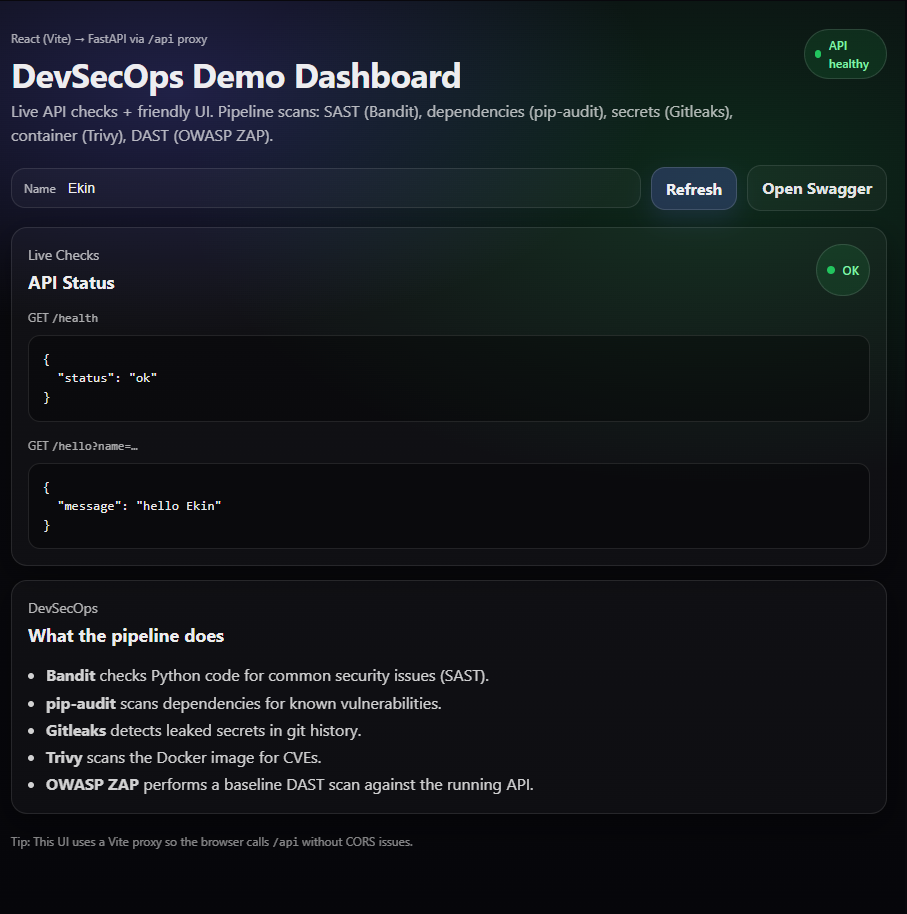

# 🔐 DevSecOps FastAPI + React Demo


[](https://github.com/Papazinmakinesi/devsecops-fastapi-react/actions/workflows/ci.yml)

A full-stack DevSecOps demonstration project that runs a containerized **FastAPI backend** and **React frontend** with an automated security pipeline in **GitHub Actions**.

---

## ✨ What’s inside
## 📸 Dashboard Preview


- **Backend:** FastAPI (Python) + Docker
- **Frontend:** React (Vite) served by Nginx
- **Reverse proxy:** `/api/*` routed from frontend → backend
- **CI / DevSecOps:** Automated scans on every push with downloadable reports (Artifacts)

---

## 🧱 Architecture

```mermaid
flowchart LR
  U[User Browser] -->|HTTP :5173| F[Nginx Frontend Container]
  F -->|/api/*| B[FastAPI Backend Container :8000]
  B -->|JSON| F